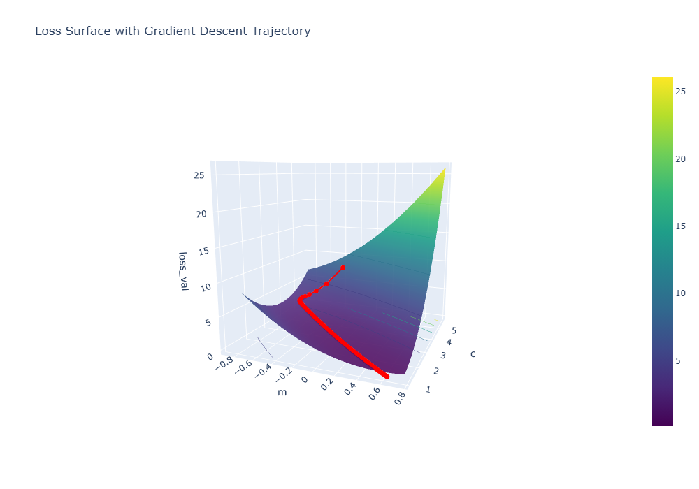
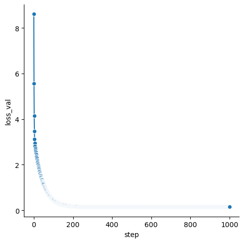
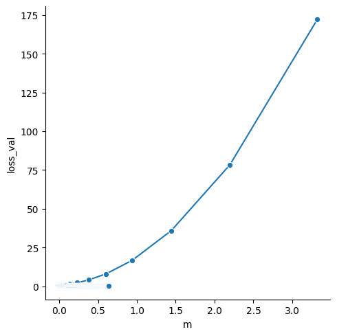
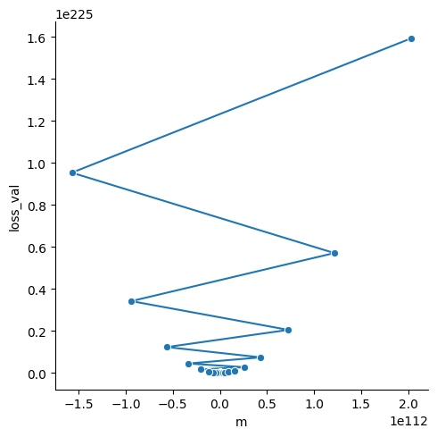

# Gradient Descent Explanation
Assuming we have a graph with 3 data points,

$$ P_0 = (0.5, 1.4) $$
$$ P_1 = (2.3, 1.9) $$
$$ P_2 = (2.9, 3.2) $$

The line of best fit can be defined as

$$ \hat{Y} = mx + c $$

And the the loss function, Mean Squared error can be defined as

$$ MSE = \frac{1}{n}\sum^{n}_{i=0}(Y_i-\hat{Y}_i) $$

Hence the loss formula will look something like this for each iteration/step

$$ \text{loss} = 
[1.4-(m(0.5)+c)]^2\\
+[1.9-(m(2.3)+c)]^2\\
+[3.2-(m(2.9)+c)]^2$$

Next, we will need to differentiate the loss function in terms of $m$ and $c$ in order to get the gradient. Let us do a small example to differentiate the loss function in terms of $m$ for $P_0$

$$\text{assume } u = (m(0.5)+c)$$
$$\frac{d\text{ loss}}{d \text{ m}}([1.4-(m(0.5)+c)]^2)$$
$$\frac{d\text{ loss}}{d \text{ m}} = \frac{d\text{ loss}}{d \text{ u}} \cdot \frac{d\text{ u}}{d \text{ m}}$$
$$= \frac{d\text{ loss}}{d \text{ u}}([1.4-u]^2) \cdot \frac{d\text{ u}}{d \text{ m}}(0.5m+c)$$
$$=(2)(1.4-u)^{2-1}(-1) \cdot (0.5)$$
$$=-2(1.4-(0.5m+c)) \cdot (0.5)$$
$$OR$$
$$=-2(y-(mx+c)) \cdot x$$

Hence, $\frac{d\text{ loss}}{d \text{ m}}$ can be defined as:

$$\frac{d\text{ loss}}{d \text{ m}} = \sum^{n}_{i=0}[-2(y_i-(mx_i+c)) \cdot x]$$

Next, we will differentiate in terms of $c$ in the same manner. 

$$\text{assume } u = (m(0.5)+c)$$
$$\frac{d\text{ loss}}{d \text{ c}}([1.4-(m(0.5)+c)]^2)$$
$$\frac{d\text{ loss}}{d \text{ c}} = \frac{d\text{ loss}}{d \text{ u}} \cdot \frac{d\text{ u}}{d \text{ c}}$$
$$= \frac{d\text{ loss}}{d \text{ u}}([1.4-u]^2) \cdot \frac{d\text{ u}}{d \text{ c}}(0.5m+c)$$
$$=(2)(1.4-u)^{2-1}(-1) \cdot (1)$$
$$=-2(1.4-(0.5m+c))$$
$$OR$$
$$=-2(y-(mx+c))$$

Hence, $\frac{d\text{ loss}}{d \text{ c}}$ can be defined as:

$$\frac{d\text{ loss}}{d \text{ c}} = \sum^{n}_{i=0}[-2(y_i-(mx_i+c))]$$

After finding those, we can finally calculate the new adjusted $m$ and $c$ based on the differentiated values. 

$$m_{i+1}=m_i-\alpha(\frac{d\text{ loss}}{d \text{ m}})$$
$$c_{i+1}=c_i-\alpha(\frac{d\text{ loss}}{d \text{ c}})$$

thats all the math there is yipee!

in this notbook, i also visualised the gradient descent trajectory with a couple of graphs

  

  

I also explored how different alpha/learning rates can affect the gradient descent trajectory

learning rate = 0.01

  

learning rate = 0.07

  

